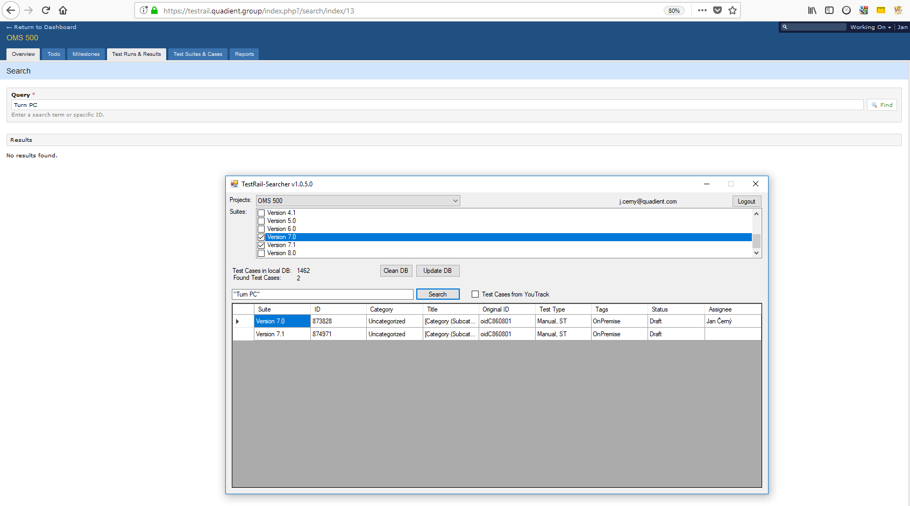

# TestRail Searcher
Windows Form application for Full text searching in TestRail. 

Compatible with TestRail *5.6.1.3841* and lower.

Comparison between native TestRail search and this tool:

## Getting started
[Manual for TestRail Searcher](https://github.com/cernyjan/TestRail-Searcher/wiki)

## Download tool
[TestRail Searcher v1.0.8.1](https://github.com/cernyjan/TestRail-Searcher/releases/tag/v1.0.8.1)

## Release Notes
### v1.0.8.1
* added location and size of window are saved for next run

### v1.0.8.0
* fixed bug: Cannot login by ENTER
* added support for resize and fullscreen mode

### v1.0.7.0
* fixed bug: App Crashes
* improved logging
* publish as Portable version

### v1.0.6.1
* fixed bug: Cannot search in State

### v1.0.6.0
* added searching above Test Type, Tags, State and Assign

### v1.0.5.0
* added more columns for found TCs

### v1.0.4.1
* minor bug fixes
* added version number into header
* little design changes
* improved error logging

### v1.0.4.0
* speed up searching and caching (breaking change) - update the database is needed
* added found Test Cases count
* added categories into found Test Cases
* added support of copy into clipboard
* added support for searching Test Cases from YouTrack
* added better searching - exact and contains
* added support for searching TestCases by Category

### v1.0.3.0
* bumped version